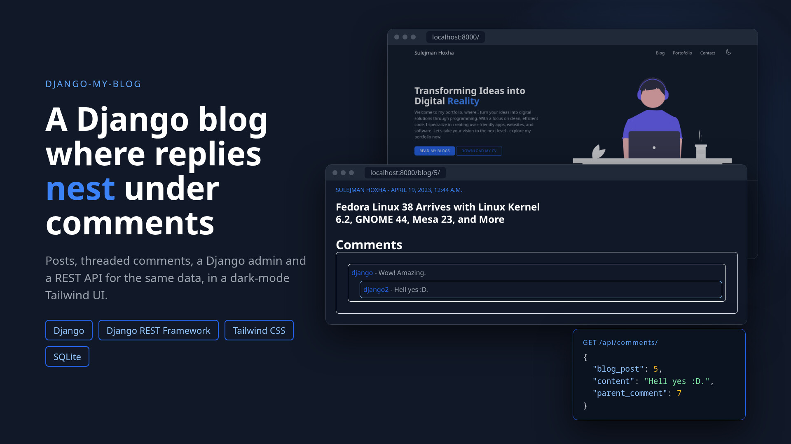

# django-my-blog



My personal blog website, built with Django and Tailwind CSS in April 2023. It has a landing page,
a list of all posts, post pages with threaded comments (a reply sits under its parent comment), the
Django admin to write posts, and a REST API (Django REST Framework) for the same posts and comments.

## Stack

- Python, Django 5.1, Django REST Framework
- Tailwind CSS 3 (prebuilt `blog/static/blog/css/main.css`), Alpine.js for the mobile menu
- SQLite for local work; PostgreSQL when `POSTGRES_HOST` is set (used for the Vercel deploy)

## Pages and endpoints

| URL | What it shows |
|---|---|
| `/` | Landing page with the latest three posts and a dark-mode toggle |
| `/blog/` | All posts |
| `/blog/<id>/` | One post with its comments and nested replies |
| `/admin/` | Django admin: posts (with picture thumbnail and inline comments) and comments |
| `/api/blogs/`, `/api/comments/` | DRF viewsets (list, create, read, update, delete). Login required: session or basic auth |

## Run it

Use Python 3.10 to 3.13 (Django 5.1 does not support Python 3.14).

```bash
git clone https://github.com/sulejmanhoxha/django-my-blog.git
cd django-my-blog
python3 -m venv .venv
source .venv/bin/activate
pip install -r requirements.txt
python manage.py runserver
```

Open http://localhost:8000/. The repository includes `db.sqlite3` with sample posts.

To start from an empty database and load the sample data instead:

```bash
export DJANGO_SQLITE_PATH=/tmp/blog.sqlite3
python manage.py migrate
python manage.py loaddata database_data.json -e contenttypes -e auth.permission -e admin.logentry -e sessions -e authtoken
python manage.py createsuperuser
python manage.py runserver
```

Or with Docker, without a local Python:

```bash
docker run --rm -it -p 8000:8000 -v "$PWD":/app -w /app -e DJANGO_SQLITE_PATH=/tmp/blog.sqlite3 python:3.12 \
  sh -c "pip install -r requirements.txt && python manage.py migrate && \
         python manage.py loaddata database_data.json -e contenttypes -e auth.permission -e admin.logentry -e sessions -e authtoken && \
         python manage.py runserver 0.0.0.0:8000"
```

### Environment variables

See `.env.example`. All are optional for local work.

| Name | Use |
|---|---|
| `DJANGO_SECRET_KEY` | Secret key. Set it in production; the default is for local development only |
| `DJANGO_DEBUG` | `1` (default) or `0` |
| `DJANGO_SQLITE_PATH` | Path of the SQLite file (default `db.sqlite3`) |
| `POSTGRES_HOST`, `POSTGRES_PORT`, `POSTGRES_DB`, `POSTGRES_USER`, `POSTGRES_PASSWORD` | Use PostgreSQL when `POSTGRES_HOST` is set |

### Tailwind CSS (optional)

The compiled CSS is committed, so you only need this to change the styles:

```bash
npm install
npm run watch   # or: npm run build
```

### Deploy on Vercel

`vercel.json` and `build_files.sh` build `base/wsgi.py` with `@vercel/python` and collect the static
files into `ui/staticfiles`. Set the environment variables above in the Vercel project.

## Project structure

```
base/                 Django project settings and URLs
blog/                 The blog app: models, views, DRF serializers and viewsets, admin
blog/templates/blog/  base, index, all_blogs and blog_detail templates
blog/static/blog/     Tailwind input and output CSS, JavaScript (dark mode), post images
database_data.json    Sample data fixture
docs/brag.jpg         Project image
```

## License

GPL-3.0, see `LICENSE`.
